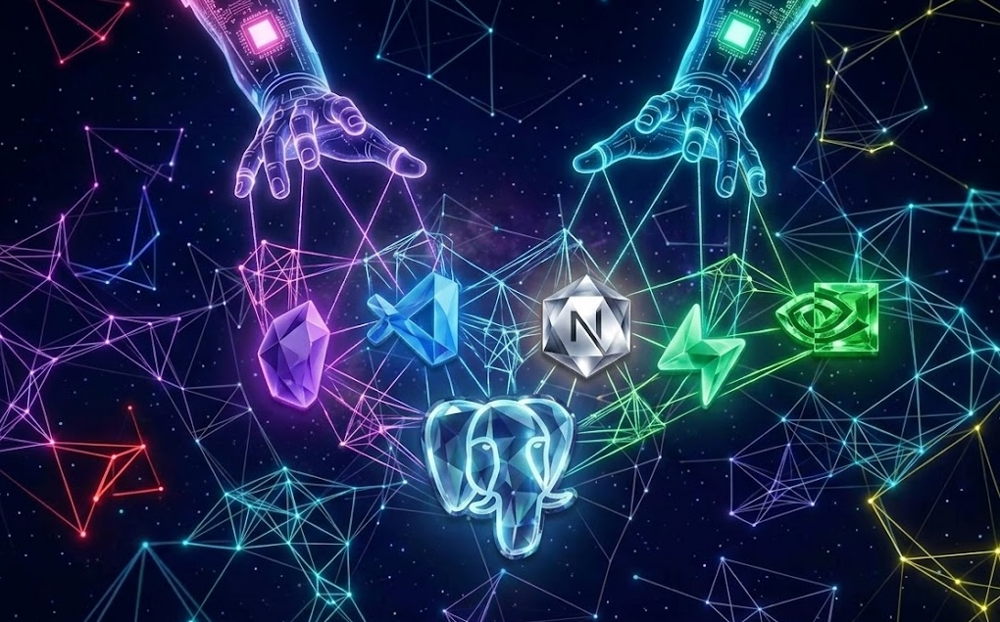
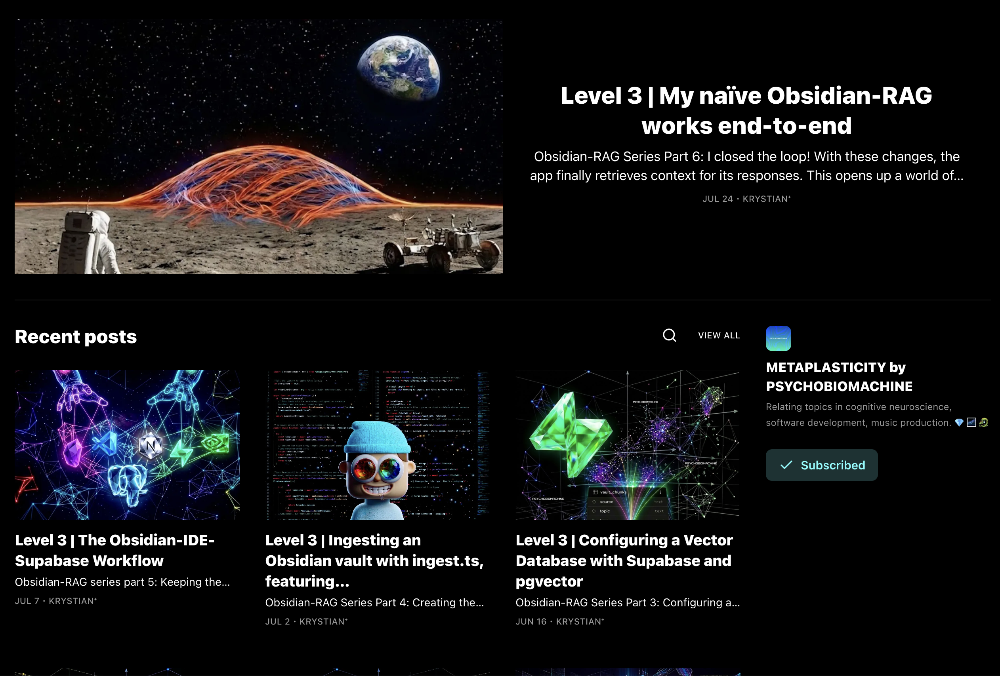

# Obsidian-RAG Starter (Naïve; text only)

A RAG chat interface for querying your Obsidian vault — Next.js, Supabase/pgvector, NVIDIA NIM (meta/llama-3.1-70b-instruct, nvidia/llama-nemotron-embed-1b-v2).




Obsidian-RAG Starter turns a personal Obsidian vault — markdown notes, canvas boards, and PDFs — into a queryable knowledge base. It walks the vault and collects eligible file paths, parses and chunks vault content, embeds the chunks via a remote embedding model, and stores chunks and vectors in Supabase for semantic retrieval.
This project was designed to operate at zero-cost using free-tier tools. This version is 'naïve' because it completes the most basic query-context retrieval operation. Modern RAG applications apply more sophisticated context engineering strategies.

Future versions of this project will involve sophisticated working memory and long-term memory strategies, multimedia document ingesting, and web search.

## Stack/Technologies
1. Next.js (interface/full-stack framework)
2. Supabase PostgreSQL + pgvector (Relational DB with Vector Embeddings)
3. NVIDIA NIM/meta/llama-3.1-70b-instruct (Open-AI compatable inference API)
4. NVIDIA NIM/llama-nemotron-embed-1b-v2 (Embedding model)
5. @Huggingface/transformers (tokenizer for the embedding model

## Models
### Inference — meta/llama-3.1-70b-instruct (NVIDIA NIM) 
Uses the OpenAI-compatible chat completions format, so swapping to any other OpenAI-compatible endpoint is a matter of changing the model string, base URL, and API key in `route.ts` — no other code changes needed. Free API key: [meta/llama-3.1-70b-instruct](https://build.nvidia.com/meta/llama-3_1-70b-instruct)
### Embedding — nvidia/llama-nemotron-embed-1b-v2 (NVIDIA NIM)
Also OpenAI-compatible. Requires `input_type: "passage"` at ingest time and `input_type: "query"` at query time — this is model-specific behavior, not a general OpenAI-compatible requirement. Free API key: [llama-nemotron-embed-1b-v2](https://build.nvidia.com/nvidia/llama-nemotron-embed-1b-v2/modelcard)


Note: the inference models are kind of slow from this provider. But there are zero rate limits beyond (40 requests per minute) which makes it a comfortable tool for prototyping.

## Memory
This project models memory loosely after human cognitive architecture — working memory, episodic memory, semantic memory, and procedural memory — rather than treating "memory" as a single undifferentiated feature. Future work in this area will draw on both frontier-model memory strategies and neurocognitive literature on how humans track conversational state.
### Working Memory
**Current working memory approach:** the entire session history is passed to the model
on every request, alongside the full retrieved context block, injected into
the system prompt. There's no summarization, no working-memory abstraction,
no compression — every prior turn and every retrieval accumulates in the
context window for the life of the conversation.

**Why this is a problem:** this is context pollution — irrelevant or
stale turns and retrieved chunks compete for attention with what's
actually relevant to the current query, and token cost grows unbounded
with conversation length.

**Future direction:** Considering query rewriting (condensing multi-turn exchanges into
a standalone query before retrieval) and adding a lighter working-memory
abstraction (like a wiki) that tracks content/themes/affect/goals. This working-memory abstraction can be passed instead of raw turn history. In addition, I am planning to follow the lead of frontier models strategies, as well as consult neurocognitive literature to reverse-engineer how humans track conversations and the states of their conversational partners and implement that logic into the app.

### Long-Term Memory
**Declarative/ Episodic Memory:** No instance of long-term episodic memory exists yet. Conversations don't get saved nor used as context in other conversations.

**Declarative/ Semantic Memory**: PostgreSQL with the pgvector extension allows the Obsidian vault files to become the apps semantic memory. Aside from raw vector embeddings and content, structured metadata (type, tags, title) exists at the chunk level but isn't yet used for anything beyond storage — no tag-based retrieval, no type filtering.

**Non-declarative/ Procedural**: Current version lacks structured reasoning, skills, or agentic-task completion capabilities. 

**Future Directions**: Persisting conversation history in Postgres, with session summaries populating a cross-session memory store. Exploring Graph-RAG or a hybrid/custom approach to semantic retrieval.
## Getting Started

### 1. Clone and install

```bash
git clone <repo-url>
cd obsidian-rag-starter
pnpm install
```

### 2. Set up Supabase

- Create a free Supabase project at [supabase.com](https://supabase.com/)
- Open the SQL editor and run the contents of `supabase/schema.sql`
  (creates the `vault_chunks` table and the `match_chunks` RPC function which depends on the table).
- Add a read-only RLS policy allowing `select` on `vault_chunks` for the
  `anon` role — the Supabase dashboard's default "Enable read access for
  all users" policy template covers this. Without it, `match_chunks` will
  silently return no results at query time even though the data exists. 
- For convenience, I added the RLS policy to the schema at `supabase/schema.sql`. If you ran the contents in the SQL editor then you should already have it.
- Note: switching embedding models might require regenerating the table and RPC function with correct vector dimensions. Current is 2048.

### 3. Get free API keys (NVIDIA NIM)

- Create an account at [build.nvidia.com](https://build.nvidia.com) (no credit card required, but needs phone number for verification)
- You'll need to generate a separate API key for each:
  - `meta/llama-3.1-70b-instruct` (inference) [meta/llama-3.1-70b-instruct](https://build.nvidia.com/meta/llama-3_1-70b-instruct)
  - `nvidia/llama-nemotron-embed-1b-v2` (embedding) [llama-nemotron-embed-1b-v2](https://build.nvidia.com/nvidia/llama-nemotron-embed-1b-v2/modelcard)

### 4. Configure environment variables

Create `.env.local` in the project root:

```bash
NEXT_PUBLIC_SUPABASE_URL=your-supabase-project-url
SUPABASE_SECRET_KEY=your-supabase-service-role-key
NEXT_PUBLIC_SUPABASE_ANON_KEY=your-supabase-anon-key
NVIDIA_META_LLAMA3_70B_API_KEY=your-inference-key
NVIDIA_EMBED_API_KEY=your-embedding-key
```

- `SUPABASE_SECRET_KEY` bypasses RLS — used only by `scripts/ingest.ts` on the host machine, never exposed to the client
- `NEXT_PUBLIC_SUPABASE_ANON_KEY` is safe to expose because it adheres to RLS policies — used by the running app at query time

### 5. Add your vault content

In `scripts/ingest.ts`, set `VAULT_DIR` to your Obsidian vault's path on
disk (or place vault files directly in the `vault/` directory and point
it there).

### 6. Run ingestion

```bash
pnpm tsx scripts/ingest.ts
```

This parses, chunks, embeds, and writes your vault content to Supabase.
Re-run any time vault content changes — existing chunks for a changed file
are deleted and replaced automatically.

### 7. Start the app

```bash
pnpm dev
```

Visit http://localhost:3000 to start chatting with your vault.
## Project Structure

```yaml
obsidian-rag-starter/
├─ src/
│  ├─ app/
│  │  ├─ api/
│  │  │   └─ epfc/route.ts   # receives chat request → calls contextv1a → calls NVIDIA NIM
│  │  └─ page.tsx            # chat UI
│  │
│  └─ lib/
│     ├─ supabase.ts         # Supabase client initialization
│     ├─ contextv1a.ts       # embed query → match_chunks RPC → return context
│     └─ tokenizer.ts        # token counting for chunk sizing
│
├─ scripts/
│  └─ ingest.ts              # parse → chunk → embed → write to Supabase
│
├─ supabase/
│  └─ schema.sql             # tables and match_chunks function; run in SQL editor
│
├─ vault/                    # optional, can live outside the project
│
└─ .env.local                # Supabase + NVIDIA NIM credentials (.gitignored)
```


## How it works
### @/app — request lifecycle: UI → API route → LLM
- `page.tsx` — chat UI. Sends the user's query and full conversation history to the API route on each message. 
- `api/epfc/route.ts` — receives the POST request: 
	1. calls `contextv1a` to embed the query and retrieve matching chunks from Supabase 
	 2. assembles the message body (system prompt + retrieved context + conversation history) 
	 3. sends the assembled request to the inference LLM 
	 4. returns the LLM's response back to `page.tsx`, which renders it in the chat window

### scripts/ingest.ts — vault → Supabase pipeline 

Run with: 
```bash
pnpm tsx scripts/ingest.ts 
```

Walks the vault directory, parses each eligible file (`.md`, `.pdf`, `.canvas`), chunks the text content, embeds the chunks, and writes them to Supabase. For each file, existing chunks are deleted and replaced with freshly embedded ones — safe to re-run any time vault content changes. The script is also idempotent –– running it twice will result in the same outcome as running it once if the contents of the vault haven't changed since last ingest.

This script uses the Supabase **secret key**, which bypasses RLS and should never be exposed to the client. It runs standalone, outside the Next.js server, so it loads `.env.local` and configures its own Supabase client rather than using the shared one in `lib/supabase.ts`.

See [docs/architecture.md](docs/architecture.md#ingest-pipeline) for chunking strategy, tokenizer details, and known limitations.

### @/lib/contextv1a.ts — context retrieval

Called from `route.ts` with the user's query.

1. Embeds the query via NVIDIA NIM (`input_type: "query"`)
2. Passes the embedding to Supabase's `match_chunks` RPC function, which
   ranks all stored chunks by cosine similarity and returns the top matches
3. Returns the matched chunks to `route.ts` for assembly into the LLM
   request

Current scope: `match_chunks` retrieves the top 3 chunks by similarity, with no
threshold and no metadata filtering — a single-pass, similarity-only
retrieval. See docs/architecture.md for planned improvements
(two-pass retrieval, tag-anchored filtering).

If the embedding call fails, retrieval fails gracefully — an empty chunk
list is returned rather than blocking the response.

### /vault 

The Obsidian vault is a plain directory of files — `.md`, `.pdf`, and `.canvas`. The vault is used only by `scripts/ingest.ts`. Not read at runtime by the chat app. 

Can live inside the project or point to a path elsewhere on host machine (see Getting Started, step 5). If kept inside the project and project gets deployed, add it to an ignore file (i.e `.vercelignore`) — vault contents can take up a lot of storage which would otherwise bloat the repo unnecessarily. Deployment platforms also impose limits on build size with free tiers so deployment would likely fail if vault is allowed into the build.

Note: if your vault contains content you don't want public, keep it outside the project directory or in `.gitignore` — this template doesn't assume anything about vault privacy on your behalf.

### @lib/supabase.ts — Supabase client 

Instantiated once and used at runtime by the chat app (as opposed to `ingest.ts`, which configures its own separate client — see that section above). 

Uses two env vars: 
- `NEXT_PUBLIC_SUPABASE_URL` — the project URL, safe to expose 
- `NEXT_PUBLIC_SUPABASE_ANON_KEY` — safe-ish to expose; this is the recommended key for client-facing code, since it respects RLS policies rather than bypassing them like the secret key does 
 
**Important:** with the anon key, `match_chunks` will silently return no results until a read-access RLS policy exists on `vault_chunks`. The RLS policy is included in the `supabase/schema.sql`. Supabase's default "Enable read access for all users" policy template also covers this. Confirmed working on localhost — not yet verified against a production deployment (e.g. Vercel).

### supabase/schema.sql — database schema

Defines the `vault_chunks` table, its RLS read policy, and the
`match_chunks` RPC function. Run the full file, top to bottom, in the
Supabase SQL editor.

**Destructive on rerun:** the table is created with `DROP TABLE ...
CASCADE`, so re-running this script wipes all existing rows — this isn't
a no-op rerun, it's a full reset. Re-ingest your vault after running it.

See [docs/architecture.md](docs/architecture.md#ingest-pipeline) for the
planned staging-table schema (`table2`), part of a future, more efficient
ingest design.

## License

Licensed under [CC BY-NC 4.0](https://creativecommons.org/licenses/by-nc/4.0/) — free to use and modify for non-commercial purposes, with attribution. Commercial use requires permission.

## METAPLASTICITY by PSYCHOBIOMACHINE



This project started as an attempt to build a chatbot using free APIs. When that turned out to be easy, I tried to add my Obsidian vault of papers and notes to the app and quickly learned that that's not how it works. I turned my learning experience into a Substack series in which I build out each step and explain the concepts I learn along the way such as retrieval augmented geeration, vector embedding, chunking, etc. I also briefly discuss parallels between RAG and human memory retrieval, as well as my goals to build a chat app the effectively mirrors the human neurocognitive system. You can check it out here if interested:
[METAPLASTICITY by PSYCHOBIOMACHINE](https://psychobiomachine.substack.com/)

# 💎🌌🐉